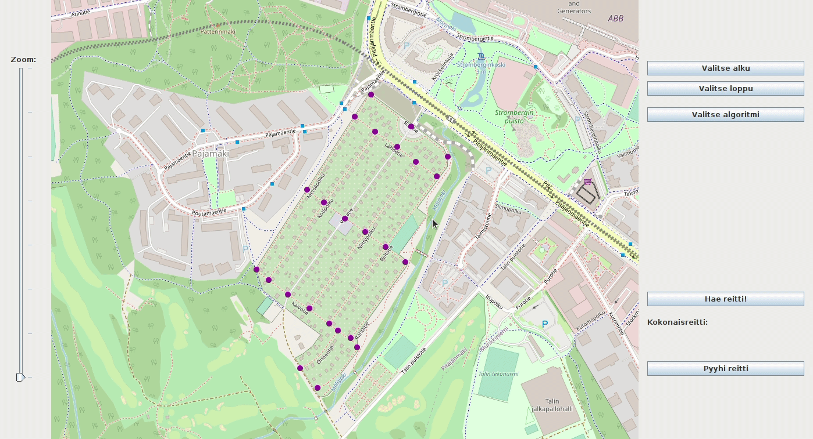

# Käyttöohje

### Sovelluksen käynnistäminen
```
./gradlew run
```

Kun sovellus käynnistyy ja verkko on luettu onnistuneesti, voit valita haluatko käyttää yksinkertaista tekstikäyttöliittymää tai visuaalista käyttöliittymää:
```
Tervetuloa!

Valitse seuraavista:
-------------------------
1 Tekstipohjainen käyttöliittymä
2 Visuaalinen käyttöliittymä

x Poistu
```

#### Tekstipohjainen käyttöliittymä
```
1 Kasittele testiverkko
2 Suorituskykytestaus
3 Lue kartan tiet

x Poistu
```

- **1 Kasittele testiverkko** tulostaa kolme eri reittiä kaikilla algoritmeilla (A*, Dijkstra ja IDA Star)
- **2 Suorituskykytestaus** suorittaa jokaista algoritmia 10 000 kierrosta kolmella eri reitillä ja laskee näiden yhteisajan ja keskiarvon
- **3 Lue kartan tiet** lukee karttadatan tiet

#### Visuaalinen käyttöliittymä



Visuaalisessa käyttöliittymässä voidaan mallintaa haettu reitti haluttua algoritmia hyödyntäen seuraavanlaisesti:
- **Valitse alku** - valitaan reitille alku
- **Valitse loppu** - valitaan reitille haluttu loppu
- **Valitse algoritmi** - valitaan käytettävä algoritmi, A Star, Dijkstra tai IDA Star
- **Hae reitti!** - hakee reitin valittua algoritmia ja alkua sekä loppu hyödyntäen sekä tulostaa matkan _Hae reitti!_ napin alle
- **Pyyhi reitti** - pyyhkii käytetyn reitin 

**Kartan liikuttaminen**
Kartan liikuttaminen onnistuu painamalla hiiren vasen painike pohjaan ja liikuttamalla hiirtä. Käyttöliittymän vasemmassa sivulaidassa on apuna lähentämiseen ja loitontamiseen liukusäädin.

### Sovelluksen testaaminen
```
./gradlew test
```

#### Jacoco

Raportti löytyy polusta /build/reports/jacoco/test/html/index.html

#### Checkstyle

Raportti löytyy polusta /build/reports/checkstyle

Pääluokille syntyy tiedosto _main.html_ ja testiluokille _test.html_

