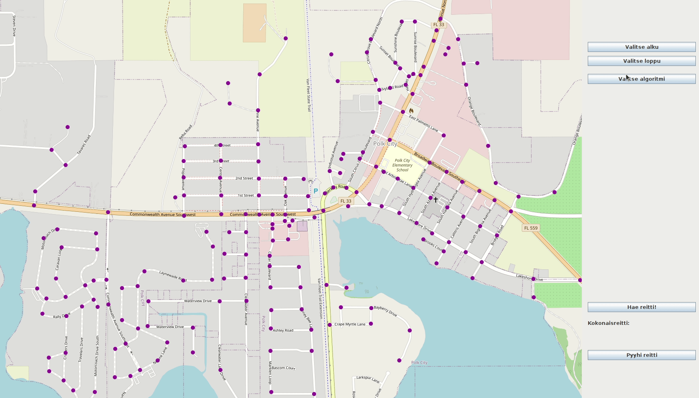

# Käyttöohje

### Sovelluksen käynnistäminen

#### Suoraan projektin juuresta

Kun käytetään alla olevaa komentoa samassa kansiossa missä gradle projekti sijaitsee käynnistyy projekti:

```
./gradlew run
```

#### generoidun shadowJarin avulla

Generoidaan shadowJar seuraavalla komennolla:

```
./gradlew shadowJar
```

Luotu bikerouteapp.jar tiedosto löytyy nyt polusta:
build/jar/bikerouteapp.jar

ja se voidaan käynnistää seuraavalla juurikansiosta:

```
java -jar build/jar/bikerouteapp.jar
```

#### Alkuvalikko

Kun sovellus käynnistyy saat valittavaksi seuraavat vaihtoehdot:

```
Tervetuloa!

Valitse seuraavista:
-------------------------
1 Suorituskykytestaus
2 Visuaalinen käyttöliittymä

x Poistu
```

#### Suorituskykytestaus

Kun valitaan vaihtoehto "1" (eli suorituskyvyn testaus), alkaa ohjelma käymään läpi luokkaa _SuorituskykyTestaus.java_ ja tulostaa suorituskyvyn tulokset reiteiltä 1, 2, 3, 4 ja 5 käyttäen projektin kaikkia kolmea algoritmia (A Star, Dijkstra ja IDA Star) erikseen. Tämän jälkeen käyttäjä voi valita suorituskykytestauksen uudelleen tai siirtyä visuaaliseen käyttöliittymään konsoliin tulostuvan ohjeistuksen mukaisesti. Esimerkkitapaus:

```
Suorituskykytestaus:

Dijkstra
-------
Reitti 1: 0.22620696199999482 s
Reitti 2: 0.25308983400000556 s
Reitti 3: 0.28570035899999563 s
Reitti 4: 0.10628040400000054 s
Reitti 5: 0.10962195200000238 s

A Star
-------
Reitti 1: 0.21454296899999947 s
Reitti 2: 0.1890614970000017 s
Reitti 3: 0.17911725299999687 s
Reitti 4: 0.15484931599999863 s
Reitti 5: 0.16997260600000275 s

IDA Star
-------
Reitti 4: 4.617391071 s
Reitti 5: 12.588928743000006 s
```

#### Visuaalinen käyttöliittymä

Kun valitaan vaihtoehto "2" (eli visuaalinen käyttöliittymä) antaa ohjelma ikkunan, jossa valitaan haluttu kartta kahdesta eri vaihtoehdosta: Davis, USA tai Tali, FI. Valinnan jälkeen siirrytään itse visuaaliseen käyttöliittymään.



Visuaalisessa käyttöliittymässä voidaan mallintaa haluttu reitti eri algoritmeja hyödyntäen seuraavanlaisesti:
- **Valitse alku** - valitaan reitille alku
- **Valitse loppu** - valitaan reitille haluttu loppu
- **Valitse algoritmi** - valitaan käytettävä algoritmi, A Star, Dijkstra tai IDA Star
- **Hae reitti!** - hakee reitin valittua algoritmia ja alkua sekä loppu hyödyntäen sekä tulostaa matkan _Hae reitti!_ napin alle
- **Pyyhi reitti** - pyyhkii käytetyn reitin 

**Kartan liikuttaminen**
Kartan liikuttaminen onnistuu painamalla hiiren vasen painike pohjaan ja liikuttamalla hiirtä. Käyttöliittymän vasemmassa sivulaidassa on apuna lähentämiseen ja loitontamiseen liukusäädin.

### Jacocon testikattavuusraportti ja Checkstyle

Jacocon testikattavuusraportti sekä Checkstyle saadaan esimerkiksi buildaamalla projekti:

```
./gradlew clean build
```

Komento buildaa ensin projektin ja generoi javadoc raportin tämän jälkeen.

**Jacoco:**

Jacocon raportti löytyy polusta /build/reports/jacoco/test/html/index.html

**Checkstyle:**

Checkstylen raportti löytyy polusta /build/reports/checkstyle
Pääluokille syntyy tiedosto _main.html_ ja testiluokille _test.html_

**Gradlen Test Summary:**

Testien yleisilmettä, määrät kesto ym. pääsee tarkastelemaan polusta:
build/reports/tests/test/index.html

### JavaDoc

JavaDocin generointi onnistuu komennolla:

```
./gradlew javadoc
```

Javadoc raportti löytyy polusta build/docs/javadoc/index.html
