# Testausdokumentti

### Testauskattavuus

Yksikkötestaukset on toteutettu projektin tärkeimmille luokille _algoritmit, komponentit ja tietorakenteet_ on toteutettu Javan JUnit kirjaston avulla. Nämä luokat pitävät sisällään projektille olennaiset algoritmit, näiden komponentit kuten kaaret ja solmut sekä tietorakenteet. Käyttöliittymään liittyvät komponentit ja tulostusluokat sekä osm.pbf muotoisen kartan käsitteleminen on jätetty huomioimatta määrittämällä nämä _build.gradle_ tiedostossa.

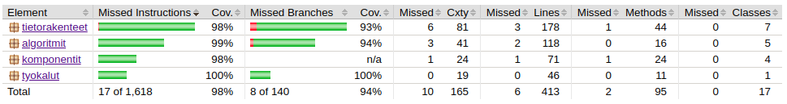

Algoritmiluokille on yhteensä 33 yksikkötestiä, komponenteille 7, tietorakenteille 39 ja työkaluille 9. Yhteensä JUnit yksikkötestejä on siis 88 kappaletta. Tietorakenteet _datastructures_ kattavuus yksikkötesteillä on 98%, haarojen kattavuus 93% ja algoritmien _algorithms_ kokonaiskattavuus on 99% haarojen kattavuuden ollessa 94%. Komponentti luokalla _components_ kokonaiskattavuus on 98%. Työkaluluokan _tyokalut_ kattavuus on 100% ja haarojen kattavuus 100%. Kokonaisuudessaan 17 riviä ei ole katettu 1618 rivistä.

### Algoritmien luotettavuus

Saadaksemme varmuuden, että algoritmit etsivät todella lyhyimmän reitin testauksissa ja suorituskyvyssä käytetyistä reiteistä, näitä verrattiin Google Mapsin reitinhakuun. 
Google Maps pyöristää tuloksen kilometreissä lähimpään kokonaislukuun yhden desimaalin tarkkuudella eli esim. 3420m -> 3,4km ja 3380 -> 3,4km.

#### Reitti 1:

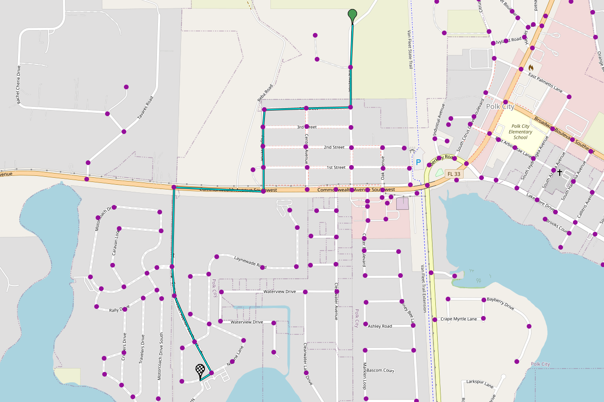

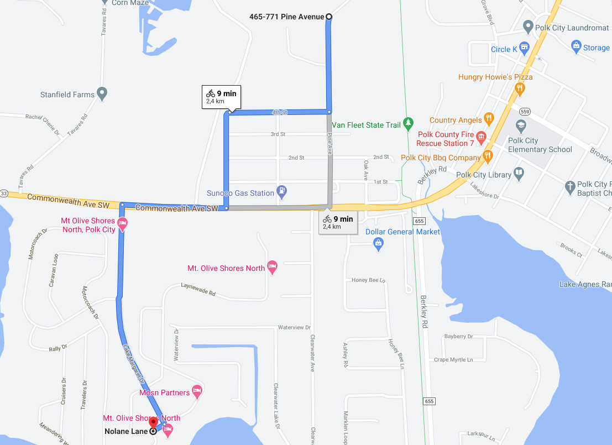

**Oman toteutuksen lyhyin reitti:** 2444.6838193006743m

**Google Mapsin lyhyin reitti:** 2,4km

#### Reitti 2:

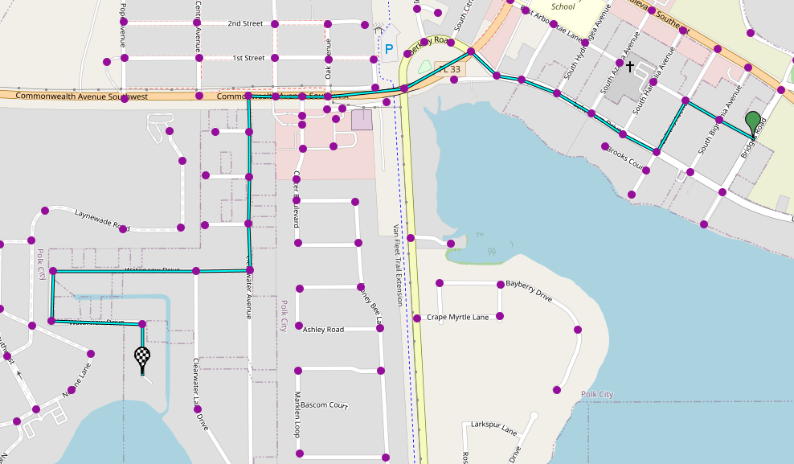

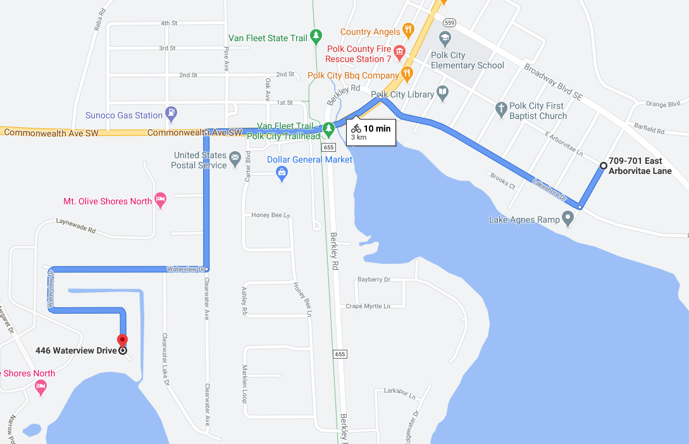

**Oman toteutuksen lyhyin reitti:** 2997.0403280132705m

**Google Mapsin lyhyin reitti:** 3.0km

#### Reitti 3:

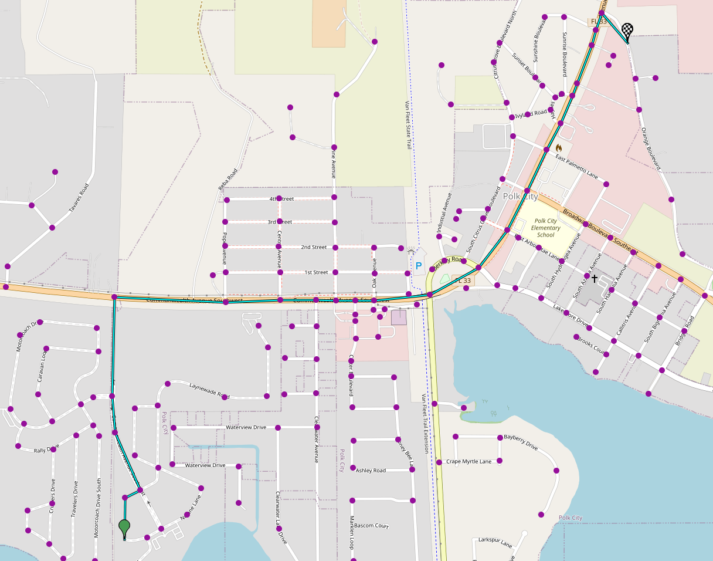

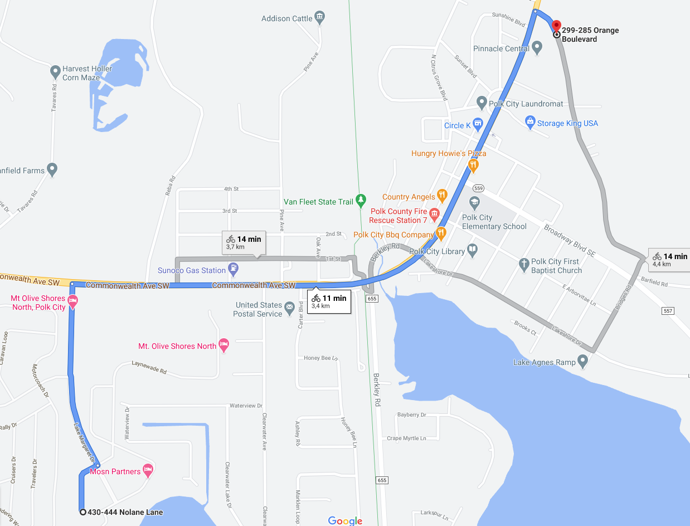

Oman lyhyin reitti: 3415.7757993535465m

Google Mapsin lyhyin reitti: 3.4km

#### Reitti 4:

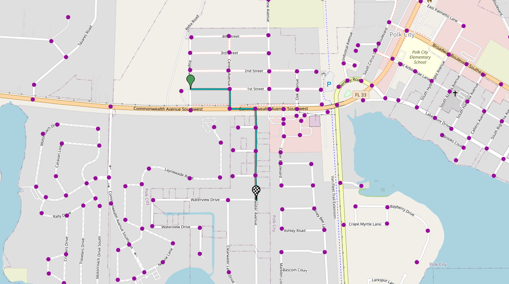

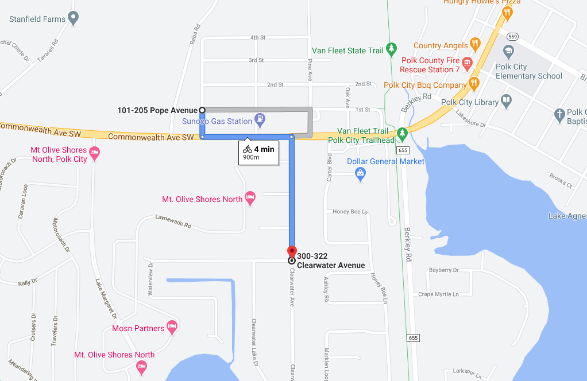

**Oman toteutuksen lyhyin reitti:** 881.4246491349884m

**Google Mapsin lyhyin reitti:** 900m

### Reitti 5:

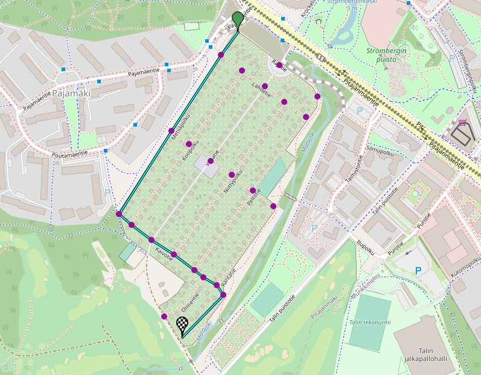

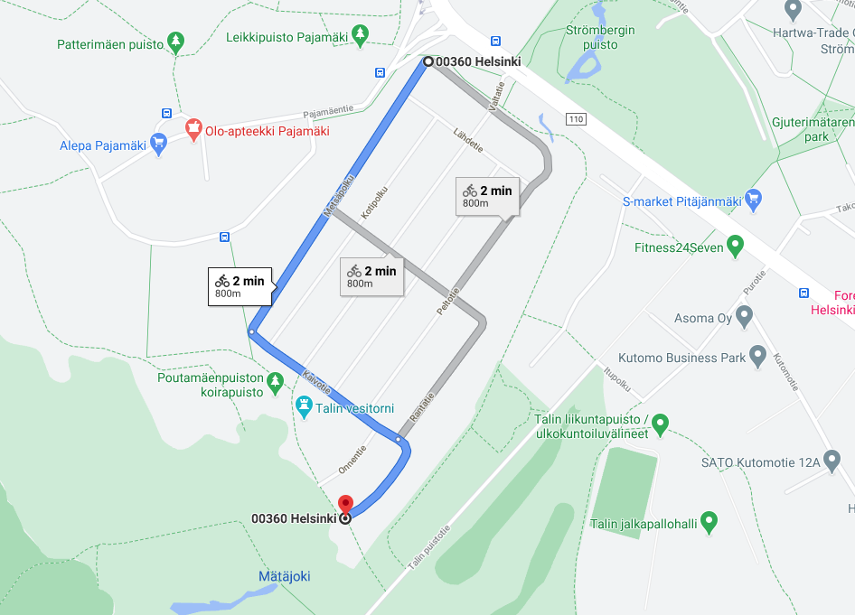

**Oman toteutuksen lyhyin reitti:** 802.839856122337m

**Google Mapsin lyhyin reitti:** 800m

Reitit syntyvät Google Mapsin reitinhakuun verrattuna identtisesti. Eroa löytyy lähinnä kokonaisreitin tuloksessa missä Google Maps pyöristää tuloksensa lähimpään kokonaislukuun yhden desimaalin tarkkuudella. Metrillisiä eroja saattaa tulla myös omien Math.x toteutuksien kautta, jotka eivät välttämättä ole yhtä tarkkoja kuin Javan omat toteutukset. Tällöin pidempien kaarien laskettu pituus saattaa heittää varsinkin pidemmillä matkoilla. Kaarien etäisyydet (painot) lasketaan projektissa Haversine Formulan avulla, jota on testattu luokassa _HeuristiikkaTest.java_.

### Suorituskyky ja suorituskyvyn vertailu

Suorituskykyä testataan yllä olevilla reiteillä. Toteutettu IDA Star algoritmi löytää reitin, mutta on hidas joten tämän suorituskykyä vertaillaan reiteillä 4 ja 5. Suorituskyvyssä hyödynnetään _SuorituskykykyTestaus.java_ luokkaa, joka hyödyntää _System.nanoTime()_ metodia.

Nopeudeltaan järkeviä ja vertauskelpoisia algoritmeja ovat projektissa toteutetut Dijkstra ja A Star. IDA Star on vuorostaan isommalla kartalla sen verran hidas, että kierrokset jota käytetään edellämainituissa algoritmeissä olisivat liian hitaita IDA Starilla.

|   | Reitti 1  | Reitti 2  | Reitti 3  |  Reitti 4 |  Reitti 5 |
|---|---|---|---|---|---|
| Dijkstra  |  0.22620696199999482 s |  0.25308983400000556 s | 0.28570035899999563 s  | 0.10628040400000054 s  | 0.10962195200000238 s  |
| A Star  | 0.21454296899999947 s  | 0.1890614970000017 s  | 0.17911725299999687 s  | 0.15484931599999863 s  | 0.16997260600000275 s  |
| Kierroksia  | 100000  | 100000  |  100000 |  100000 | 100000  |

IDA Star algoritmin suorituskykyä testattu reiteillä 4 ja 5, jotka ovat pituudeltaan lyhyempiä reittejä:

|   | Reitti 4 |  Reitti 5 |
|---|---|---|
| IDA Star  | 4.617391071 s  |  12.588928743000006 s |
| Kierroksia  |  100 | 1000  |

Dijkstra näyttää löytävän selkeästi helpomman reitin reitin nopeammin (esim reitit 4 ja 5 jossa lähtösolmusta maaliin ei käydä niin montaa solmua läpi), mutta A Star on nopeampi pidemmissä reiteissä (reitit 1, 2 ja 3) varmasti heuristiikkansa ansiosta. IDA Star algoritmissä on vuorostaan joitakin suorituskyvyllisiä haasteita. 

