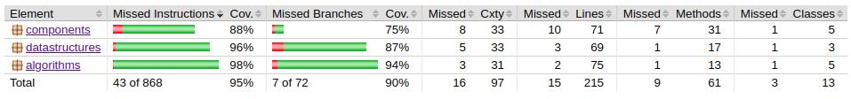

# Testausdokumentti

### Yksikkötestit

Yksikkötestaukset on toteutettu projektin tärkeimmille luokille _algorithms, components ja datastructures_ on toteutettu Javan JUnit kirjaston avulla. Nämä luokat pitävät sisällään projektille olennaiset algoritmit, näiden komponentit kuten kaaret ja solmut sekä tietorakenteet. Käyttöliittymään liittyvät komponentit ja tulostusluokat sekä osm.pbf muotoisen kartan käsitteleminen on jätetty huomioimatta määrittämällä nämä _build.gradle_ tiedostossa.

#### Yksikkötestien kattavuus

Komponentti luokalla _components_ kokonaiskattavuus on 88%, haarojen kattavuus 75%. Tietorakenteet _datastructures_ kattavuus yksikkötesteillä on 96%, haarojen kattavuus 87% ja algoritmien _algorithms_ kokonaiskattavuus on 98% haarojen kattavuuden ollessa 94%. Kokonaisuudessaan 43 riviä ei ole katettu 868:sta rivistä.

### Suorituskyky

Suorituskyky testataan algoritmien välillä laskemalla 1000 iteraation verran aikaa, jonka algoritmit käyvät läpi tietyn reitin paikasta A paikkaan B ja laskemalla näiden keskiarvo. Suorituskyvyssä hyödynnetään _SuorituskykykyTestaus.java_ luokkaa, joka hyödyntää _System.nanoTime()_ metodia. Testaus toteutetaan kaikille algoritmeille samalla reitillä ja joka iteraation jälkeen kaikki testaukseen käytetyt rakenteet resetoidaan.

#### Suorituskyvyn vertailu

_tähän visuaaliset esitykset suorituskyvyistä_
