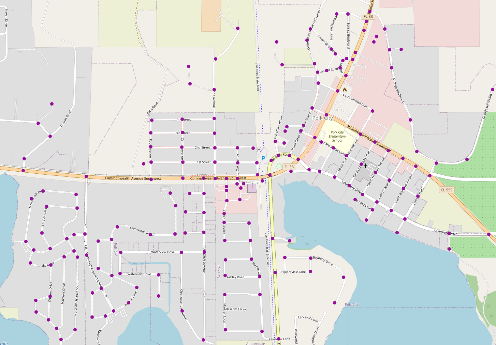

# Toteutusdokumentti

## Ohjelman yleisrakenne

Projektissa toteutettiin kolme erilaista reitinhakualgoritmia. Nämä algoritmit ovat Dijkstra, A Star ja IDA Star. Käytännössä A Star on paranneltu versio Dijkstrasta ja IDA Star paranneltu versio A Starista.

Projektin rakenne on seuraava:
- Paketissa _algoritmit_ on A Star, Dijkstra sekä IDA Star
- Paketissa _komponentit_ on Heuristiikka, Kaari, Solmu ja Verkko
- Paketissa _tietorakenteet_ on ArrayList, HashMap, HashSet, PriorityQueue ja Stack
- Paketissa _io_ on VerkonLukija joka lukee kaksi karttaa txt muotoisista tiedostoista
- Paketissa _suorituskykytestaus_ on suorituskykytestaukselle luokka SuorituskykyTestaus
- Paketissa _tyokalut_ on luokka Matikka joka pitää sisällään omia toteutuksia javan Math.x metodeista _(itseisarvo, kertoma, potenssi, neliöjuuri, radiaani, sini, kosini, arkustangentti ja arkustangentti2)_
- Paketissa _ui_ on Käyttöliittymä sekä käyttöliittymän apuluokat Etappi, EtappienKasittelija ja ReitinPiirtaja

### Kartat

Projektissa on käytössä kaksi karttaa: osa Davisin kaupungista Yhdysvalloissa sekä toinen mukailtu talin siirtolapuutarhaa.

#### Davis (198 solmua)

#### Talin siirtolapuutarha (24 solmua)

## Aika- ja tilavaativuudet

### Algoritmit

**Dijkstra:**
Aikavaativuus: O((|E| + |V|) log |V|) missä |E| on kaarien lukumäärä (edges) ja |V| on solmujen lukumäärä (vertices)
Tilavaativuus: O(|V|)

**A Star:**
Aikavaativuus: O((|E| + |V|) log |V|) missä |E| on kaarien lukumäärä (edges) ja |V| on solmujen lukumäärä (vertices)
Tilavaativuus: O(|V|)

**IDA Star:**
Aikavaativuus: O(b^d)
Tilavaativuus: O(d) 

Missä b on uloimpien solmujen lapsisolmujen lukumäärä _(branching factor)_ ja missä d on ensimmäisen löydetyn reitin syvyys

### Tietorakenteet

Toteutettujen metodien aikavaativuudet:

**ArrayList** 

- _add()_, O(1) (listan kokoa kasvatettaessa O(n))
- _get()_, O(1)
- _contains()_, O(n)
- _listaTaysi()_, O(1)
- _size()_, O(1)
- _isEmpty()_, O(1)

**HashSet** 
- _add()_, O(1) (listan kokoa kasvatettaessa O(n))
- _contains_, O(1), pahin tapaus O(n)
- _size()_, O(1)
- _isEmpty()_, O(1)

**HashMap**
- _get()_, O(1)
- _put()_, O(1) listan kokoa kasvatettaessa O(n))

**Stack** Last In First Out -menetelmällä
- _push()_, O(1)
- _pop()_, O(1)
- _peek()_, O(1)
- _contains()_, O(n)

**PriorityQueuen** 
- _add()_, O(n)
- _contains()_, O(n)
- _poll()_, O(n)
- _size()_, O(1)
- _isEmpty()_, O(1)

## Puutteet ja parannusehdotukset

- Olisi mielenkiintoista tietää miten kaksisuuntaiset toteutukset _(bidirectional)_ algoritmeistä toimisivat kartalla ja nopeuttaisiko nämä lyhimmän reitin etsintää
- IDA Star toimii hitaanlaisesti, Wikipedian pseudokoodiin verrattuna en löytänyt koodistani virheitä, hitaus liittyy varmasti jotenkin ylimääräisten solmujen läpikäyntiin rekursiivisessa haussa
- Osa matikkaluokan omista Math.x metodeista palvelee vain projektin omaa käyttötarkoitusta
- Projektin suurimpana haasteena oli karttadatan saaminen, projektiin voisi lisätä vielä isompia karttoja kahden käytössä olevan lisäksi

#### Lähteet

- [A* algorithm](https://en.wikipedia.org/wiki/A*_search_algorithm), Wikipedia
- [Introduction to the A* Algorithm](https://www.redblobgames.com/pathfinding/a-star/introduction.html), Red Blob Games
- [Dijkstra's algorithm](https://en.wikipedia.org/wiki/Dijkstra%27s_algorithm), Wikipedia
- [Iterative deepening A*](https://en.wikipedia.org/wiki/Iterative_deepening_A*), Wikipedia
- [Time complexity of iterative-deepening-A∗](https://www.sciencedirect.com/science/article/pii/S0004370201000947), Richard E. Korf,  Michael Reid & Stefan Edelkamp
